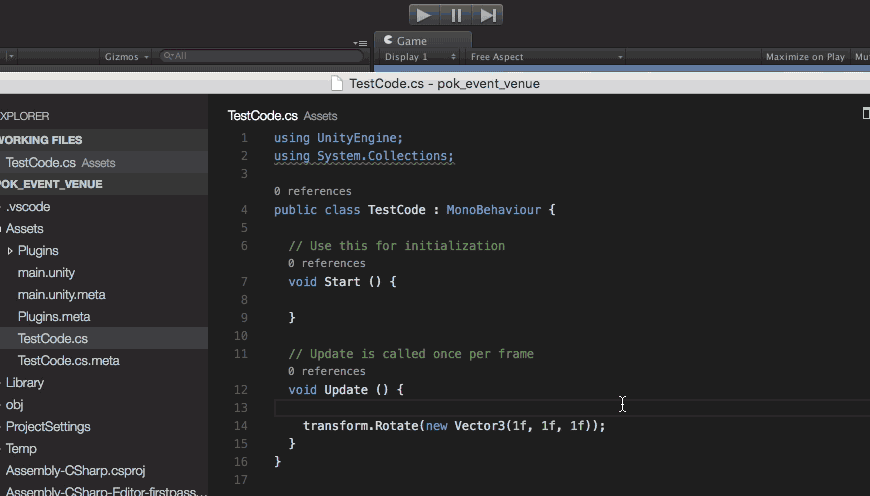

# VSCode → Unity Run！ for OSX

Run unity from VSCode.

Press `cmd+p`, then activate Unity Window and run unity scene.




# Install

require `vsce` and vscode commandline tool.


    $ npm install -g vsce

and [Setting up Visual Studio Code](https://code.visualstudio.com/docs/editor/setup#__mac-os-x) `Shell Command: Install 'code' command in PATH`


## build

```shell
$ vsce package
$ code unity-runner-0.0.1.vsix
```

restart VSCode!


# customize keymap

edit `package.json`


```package.json

"keybindings": [{
    "command": "extension.runUnity",
    "key": "ctrl+p",
    "mac": "cmd+p"
}]
```


